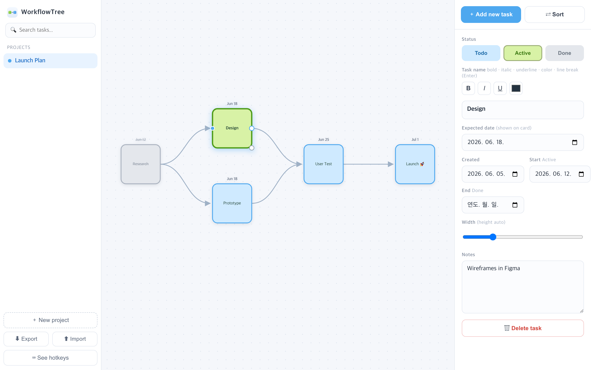

# WorkflowTree

A lightweight, **local-first visual workflow board** for macOS. Lay out tasks as rounded
cards, connect them with smooth arrows, track status and dates, and auto-arrange by
dependencies — all in a native window. No accounts, no cloud, no browser required.

The whole app is a single `index.html` (vanilla JS + SVG) wrapped in a tiny native
**WKWebView** app, so it runs as a real macOS app and stores everything locally.



---

## Features

- **Cards** with rich-text names — **bold**, *italic*, underline, color, line breaks.
  Cards are rounded squares that grow taller automatically when the text doesn't fit.
- **Status colors** — Todo (sky blue), Active (green), Done (gray + strikethrough).
- **Dates per card** — *Expected* (shown above the card), *Created* (auto), *Start*
  (stamped when you hit Active), *End* (stamped when you hit Done). All editable.
- **Notes** for every card.
- **Arrows** — drag from a card's right port to another card; smooth curved connectors
  that always leave the source on the right and enter the target on the left.
- **Auto-layout (Sort)** — arrows decide columns (left → right); a card with an arrow goes
  to the right of its source even on the same date. Expected date sets the minimum column.
  Chains stay on one row; when several cards point to one, the sources stack vertically by
  creation date.
- **Multi-select** — marquee-drag to select many cards, then move them together (with snap).
- **Snap, duplicate, swap, resize** — Shift to snap to other cards' centers, ⌥-drag to
  duplicate, Shift+C to swap two cards, drag the bottom-right handle to resize width.
- **Projects** — multiple boards in the sidebar; opens the last one you edited.
- **Search** tasks by name and jump straight to the card.
- **Undo** (last 5 actions), pan/zoom canvas, hover-to-zoom cards.
- **Export / Import** your data as JSON (backup or move between machines).
- **Analyze workload with Claude** — one click runs the local `claude` CLI
  (your existing Claude Code login — no API key, no extra cost) and returns a
  concise focus / bottleneck / critical-path / next-steps analysis of the board.

---

## Install

**Requirements:** macOS 11+ and the Xcode Command Line Tools (provides `clang`).
If you don't have them: `xcode-select --install`.

```bash
git clone https://github.com/MinchoU/WorkflowTree.git
cd WorkflowTree
./build.sh
```

`build.sh` compiles the native wrapper, bundles the web app inside it, and installs
**`/Applications/WorkflowTree.app`**. Launch it from Spotlight or Finder.

> First launch: because the app is ad-hoc signed (not notarized), macOS may warn.
> Right-click the app → **Open** once, and it will open normally afterwards.

To install somewhere else: `./build.sh ~/Applications/WorkflowTree.app`

---

## How to use

1. Click **＋ Add new task** (top-right) to drop a card, then type its name.
2. Click a card to edit its **name, dates, notes, status, and width** in the right panel.
3. **Connect** cards: hover a card and drag the blue dot on its right onto another card.
4. Hit **⇄ Sort** to auto-arrange by arrows and dates.
5. Manage boards in the left sidebar (**＋ New project**, ✏️ rename, ✕ delete).

### Keyboard & mouse

| Action | How |
| --- | --- |
| Add a card | **＋ Add new task** |
| Select many | drag on empty space (marquee) |
| Move selection | drag a selected card · **Shift** = snap to center |
| Connect arrow | drag the blue right-dot onto another card |
| Resize width | drag the gray bottom-right dot |
| Duplicate | **⌥ Option + drag** a card |
| Swap two cards | click one, then **Shift + C + click** another |
| Delete | **Delete** (removes selected card(s) / arrow) |
| Undo | **⌘Z** (last 5 actions) |
| Pan / Zoom | **Space + drag** (or middle-mouse) · scroll to zoom |
| Sort | **⇄ Sort** |
| Shortcuts popup | **⌨ See hotkeys** (sidebar) |

---

## Data & backup

Your boards are stored in the app's local web storage (nothing leaves your machine).
Use **⬇ Export** (sidebar) to save a `workflowtree-backup.json`, and **⬆ Import** to load
one back — handy for backups or moving to another Mac.

---

## How it works

- `index.html` — the entire app (UI, canvas, storage) in one file. Open it in any browser
  too, if you prefer a tab over the native window.
- `native/main.m` — an Objective-C wrapper that hosts the page in a `WKWebView`.
  It serves the bundled files over a private `wt://localhost` origin so `localStorage`
  persists reliably, wires up file open/save panels and standard menu shortcuts, and
  runs `claude -p` for the workload analysis (using your local Claude Code login).
- `icon.svg` / `icon.icns` — the app icon (a green box → blue box arrow).
- `build.sh` — compiles and installs the `.app`.

## License

MIT — see [LICENSE](LICENSE).
